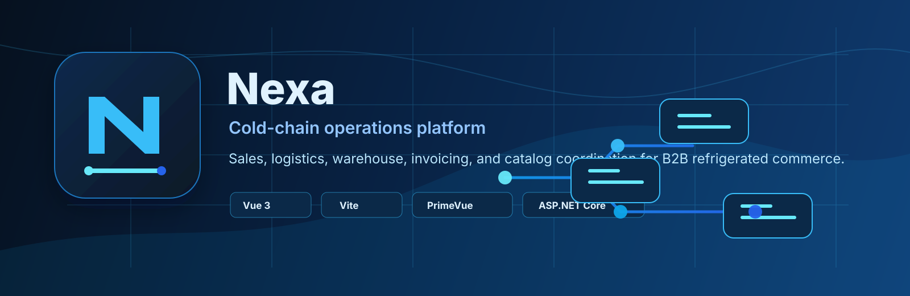

 

  

# Nexa Suite

**Cold-chain operations platform for coordinated B2B refrigerated food commerce.**

 

 

 

---

## What is Nexa?

Nexa is an academic software platform designed to streamline B2B refrigerated food commerce. It replaces manual logistics and unscheduled communications with structured digital workflows, giving B2B buyers and distributors shared visibility over orders, inventory levels, routes, and invoices.

The project is currently undergoing a complete architecture and interface migration, transitioning from a legacy Vue/ASP.NET stack to a modern Angular/Spring Boot stack.

---

## Repository Map

### 🚀 Modern Migration Target Stack
These repositories represent the active modern migration path that will serve as the final production targets.

<table>
  <tr>
    <td width="50%">
      
<strong><a href="https://github.com/nexa-suite/api-spring">api-spring</a></strong>

      
Central multi-tenant REST API backend. Built using Spring Modulith for robust boundary enforcement.

      

        
        
        
        
      

    </td>
    <td width="50%">
      
<strong><a href="https://github.com/nexa-suite/platform-angular">platform-angular</a></strong>

      
Operations dashboard for internal users (owners, sales, and logistics coordinators).

      

        
        
        
      

    </td>
  </tr>
  <tr>
    <td width="50%">
      
<strong><a href="https://github.com/nexa-suite/portal-angular">portal-angular</a></strong>

      
Buyer self-service portal for catalog browsing, purchase requests, and order tracking.

      

        
        
        
      

    </td>
    <td width="50%">
      
<strong><a href="https://github.com/nexa-suite/mobile">mobile</a></strong>

      
Cross-platform client for field operators, warehouse scanning, and logistics dispatch.

      

        
        
        
      

    </td>
  </tr>
</table>

### 🌐 Public Client
This repository represents the public face and legal landing page of the product.

<table>
  <tr>
    <td width="100%">
      
<strong><a href="https://github.com/nexa-suite/website">website</a></strong>

      
Public landing website, commercial presentation, FAQ, pricing tables, and legal policies.

      

        
        
        
      

    </td>
  </tr>
</table>

### 🏛️ Legacy Reference Stack
These repositories serve as the visual, database schema, and behavioral reference for migration. They will remain read-only during the modern transition.

<table>
  <tr>
    <td width="33%">
      
<strong><a href="https://github.com/nexa-suite/api">api</a></strong>

      
Legacy C# API reference.

      

        
      

    </td>
    <td width="33%">
      
<strong><a href="https://github.com/nexa-suite/platform">platform</a></strong>

      
Legacy Vue operations dashboard.

      

        
      

    </td>
    <td width="34%">
      
<strong><a href="https://github.com/nexa-suite/portal">portal</a></strong>

      
Legacy Vue buyer portal reference.

      

        
      

    </td>
  </tr>
</table>

---

## Bounded Contexts & Product Areas

| Area | Purpose | Core Responsibilities |
| :--- | :--- | :--- |
| **Sales** | B2B Purchase Coordination | Order registration, approval workflows, commercial policies, client lists |
| **Logistics** | Dispatch Tracking | Routing sheets, delivery coordinates, shipment progress, temperature logs |
| **Warehouse** | Cold-Chain Inventory | Cold-storage lots, inventory levels, warehouse stock tracking, item reservations |
| **Invoicing** | Transaction Reconciliation | Automated invoices, receipts, payment records, billing logs |
| **Catalog** | B2B Product Listing | Active items, custom client pricing lists, food category listings |
| **IAM & Tenant** | Access & Membership | Tenant isolation, multi-tenant roles, workspace memberships, token issuance |

---

## Delivery & SCM Standards

We maintain clean engineering history and traceability using unified standards:

* 🌿 **Branch Strategy**: We adhere to **GitFlow** branch governance. Direct commits to `main` are restricted.
* 💬 **Conventional Commits**: Commit messages must follow the Conventional Commits 1.0.0 specification with explicit Context, Changes, Reason, and Validation blocks.
* 🏷️ **Semantic Versioning**: Deliveries correspond to SemVer 2.0.0 (`MAJOR.MINOR.PATCH`).
* 📜 **API Releases**: Release logs are risk-focused, documenting payload changes and deprecation timelines with active HTTP Sunset dates.

---

## Team

| Member | Code | Focus | GitHub Profile |
| :--- | :--- | :--- | :--- |
| **Yucra Sandoval, Diego Sebastian** | U202323040 | Team Leader / Sales | [@DiegoS284](https://github.com/DiegoS284) |
| **Marín Cueva, César Fernando** | U202411937 | Logistics & Sales | [@Cmarin2802](https://github.com/Cmarin2802) |
| **Verde Bueno, Joaquín Francisco** | U20241A054 | Warehouse | [@JoaquinVerde115](https://github.com/JoaquinVerde115) |
| **Torrejón De Los Santos, Gino Rodrigo**| U202416289 | Catalog & Warehouse | [@R0obxdnt-bit](https://github.com/R0obxdnt-bit) |
| **Rojas Mancilla, Gerard Gianpier** | U202413142 | Invoicing | [@GerardRojasMancilla](https://github.com/GerardRojasMancilla) |

---

## Academic Context

* **University**: Universidad Peruana de Ciencias Aplicadas (UPC)
* **Course**: Aplicaciones Web (*1ASI0730*)
* **Academic Cycle**: 2026-10
* **Course Focus**: Validating B2B Cold-Chain Distribution Platform UI & Architecture

---

  <strong>Nexa Platform</strong> · Universidad Peruana de Ciencias Aplicadas · 2026-10

